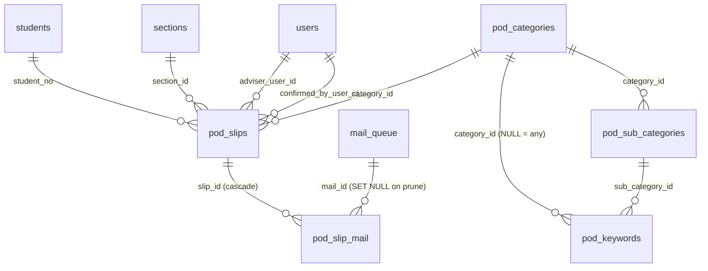

# POD × AttendTrack — Database Report

**Scope:** the AttendTrack (ABC) tables the POD module reads — `students`, `sections`, `users`, `subjects`, `teacher_assignments`, `timetable_slots`, `schedule_day_overrides`, `class_cancellations`, `attendance_records`, `attendance_marks`, `settings` — and the `pod_*` tables POD adds when it moves into ABC.
**Sources:** attendtrack branch `clinic` at `7638033` (2026-09-21) for DDL, code and the POD attendance API; branch `live` at `ab45e99` (2026-09-01, the deployed code) for confirmation; `POD_Handover.md` in this repo for POD's own behaviour.
**Status legend:** **Live** = on the deployed branch · **Clinic** = on the newest branch only · **Planned** = proposed here, not yet built.

Everything in §1 to §5 describes what exists. §6 is a proposal. §7 lists things to watch.

---

## 1. Overview

ABC stores attendance **per class period**, not per day: a teacher records one `attendance_records` row for a section, subject and half-day, and one `attendance_marks` row per student in it with `P`, `A`, `L` or `E`. A student who misses a whole day therefore produces one `A` per subject that day. Any "daily attendance" is a roll-up of those marks, and the four schedule tables say which classes *should* have been recorded, so that "no record" is never confused with "absent".

The eleven tables fall into three groups:

| Group | Tables | POD uses them for |
|---|---|---|
| Roster and identity | `students`, `sections`, `users`, `subjects`, `settings` | Who the student is, their section and adviser, staff accounts, feature flags and the API key |
| Attendance | `attendance_records`, `attendance_marks` | The marks a daily status is rolled up from |
| Schedule | `timetable_slots`, `teacher_assignments`, `schedule_day_overrides`, `class_cancellations` | Which classes were expected on a date, so an unrecorded day reads as "not recorded", and which teacher owns a class |

All eleven are identical on `live` and `clinic` except one column: `users.role` is an `ENUM` of five values on `live` and a `VARCHAR(32)` on `clinic` (migration `006_custom_roles.sql`). Every table is InnoDB, `utf8mb4_unicode_ci`, and every date and time is **Asia/Manila local time**; nothing is stored in UTC.

Known volumes, from the dataset ABC was verified against on 2026-07-21:

| Table | Rows |
|---|---|
| `students` | 2,060 |
| `users` | 180 staff |
| `attendance_records` | 58,000 |
| `attendance_marks` | 2,000,000 |

---

## 2. Entity-relationship diagram

```mermaid
erDiagram
    sections ||--o{ students : "section_id"
    sections ||--o{ users : "homeroom (users.section_id)"
    sections ||--o{ attendance_records : "section_id (NULL for school-wide)"
    sections ||--o{ timetable_slots : "section_id"
    sections ||--o{ class_cancellations : "section_id"
    sections ||--o{ teacher_assignments : "section_id"
    subjects ||--o{ attendance_records : "subject_id (class mode)"
    subjects ||--o{ timetable_slots : "subject_id (NULL = special slot)"
    subjects ||--o{ class_cancellations : "subject_id"
    subjects ||--o{ teacher_assignments : "subject_id"
    users ||--o{ attendance_records : "recorded_by"
    users ||--o{ timetable_slots : "teacher_user_id"
    users ||--o{ teacher_assignments : "user_id"
    users ||--o{ schedule_day_overrides : "created_by"
    users ||--o{ class_cancellations : "cancelled_by"
    attendance_records ||--o{ attendance_marks : "record_id (cascade)"
    students ||--o{ attendance_marks : "student_no"

    sections {
        int section_id PK
        varchar grade
        varchar section_name
        varchar label
        varchar school_year
        varchar adviser_email
    }
    students {
        varchar student_no PK
        varchar full_name
        int section_id FK
        varchar email
        tinyint active
    }
    users {
        int user_id PK
        varchar email
        varchar full_name
        varchar role
        varchar bands
        int section_id FK
        tinyint active
    }
    subjects {
        int subject_id PK
        varchar name
        tinyint active
    }
    attendance_records {
        bigint record_id PK
        date record_date
        int section_id FK
        enum mode
        int subject_id FK
        varchar session_name
        enum half
        tinyint period
        int recorded_by FK
    }
    attendance_marks {
        bigint record_id PK_FK
        varchar student_no PK_FK
        varchar status
    }
    timetable_slots {
        int slot_id PK
        varchar school_year
        tinyint semester
        int section_id FK
        tinyint weekday
        tinyint period
        int subject_id FK
        varchar label
        int teacher_user_id FK
    }
    schedule_day_overrides {
        date override_date PK
        tinyint follows_weekday
        varchar note
    }
    class_cancellations {
        int cancel_id PK
        date cancel_date
        int section_id FK
        int subject_id FK
        varchar reason
    }
    teacher_assignments {
        int user_id PK_FK
        int section_id PK_FK
        int subject_id PK_FK
    }
    settings {
        varchar setting_key PK
        text setting_value
    }
```

The planned `pod_*` tables hang off `students`, `sections`, `users` and `mail_queue`; their diagram is in §6.1.

---

## 3. Data dictionary — roster and identity

### 3.1 `sections` — Live

One row per class section per school year. The label is the join key to POD's historical `grade_section` text.

| Column | Type | Null | Meaning |
|---|---|---|---|
| `section_id` | INT UNSIGNED, PK, auto | no | |
| `grade` | VARCHAR(20) | no | `Grade 7`, `Kinder`, `Prep` (the importer builds labels from `grade - section_name`, and `grade_band()` matches `^Grade (\d+)$`, so the stored value carries the word "Grade") |
| `section_name` | VARCHAR(50) | no | `A`, `St. Ignatius`, `Obedience` |
| `label` | VARCHAR(80) | no | Display: `Grade 7 - A`. Same shape as POD's `grade_section` |
| `school_year` | VARCHAR(9) | no | `2026-2027` |
| `adviser_email` | VARCHAR(190) | yes | The adviser's email. This is what POD's kiosk needs to auto-assign an adviser |

Keys: `UNIQUE (school_year, grade, section_name)`.

POD use: section of a slip, department via `grade_band()` (GS ≤ 6, JHS 7–10, SHS 11–12, Kinder/Prep → GS), adviser lookup via `adviser_email` → `users.email`.

### 3.2 `students` — Live

The roster. Natural primary key; the same `student_no` POD stores on every slip as `student_id`.

| Column | Type | Null | Meaning |
|---|---|---|---|
| `student_no` | VARCHAR(20), PK | no | School-issued number, the identity key everywhere |
| `full_name` | VARCHAR(150) | no | |
| `section_id` | INT UNSIGNED, FK → sections | no | Current section. Moving a student rewrites this; history follows the new section |
| `gender` | ENUM('M','F') | yes | |
| `program` | VARCHAR(60) | yes | `Grade School`, `STEM STRAND`, … |
| `rfid` | VARCHAR(40) | yes | Card tag; no code path uses it yet |
| `date_enrolled` | DATE | yes | |
| `email` | VARCHAR(190) | yes | **Empty in the live data.** The roster import has no email column. POD holds emails for all but 16 students and is the richer source |
| `household_id` | INT UNSIGNED, FK → households | yes | Sibling grouping for parent events |
| `active` | TINYINT(1), default 1 | no | Soft removal; history stays |

Keys: `idx_students_section`, `idx_students_household`.

POD use: kiosk search (name or number, active only), the student snapshot on a slip, the student email for notifications once populated.

### 3.3 `users` — Live (column type differs on Clinic)

Staff accounts. POD's `profiles` and `teachers` both map here.

| Column | Type | Null | Meaning |
|---|---|---|---|
| `user_id` | INT UNSIGNED, PK, auto | no | |
| `email` | VARCHAR(190), unique | no | Login and the match key from POD's `teachers.email` |
| `full_name` | VARCHAR(150) | no | |
| `role` | `ENUM('superadmin','admin','adviser','teacher','nonteaching')` on live; `VARCHAR(32)` on clinic | no | Built-in roles, plus custom roles on clinic. Role → permission atoms, see §3.6 |
| `password_hash` | VARCHAR(255), default '' | no | Empty = invited, cannot sign in yet |
| `must_set_password` | TINYINT(1), default 1 | no | Same idea as POD's `must_change_password` |
| `bands` | VARCHAR(30) | yes | CSV of `GS`,`JHS`,`SHS`. **Blank means unrestricted** |
| `designations` | VARCHAR(60) | yes | Self-declared at invite: teacher, adviser, MLA, TLA, nonteaching |
| `section_id` | INT UNSIGNED, FK → sections, SET NULL | yes | An adviser's homeroom section. Second way to resolve a section's adviser |
| `active` | TINYINT(1), default 1 | no | |
| `created_at` | DATETIME | no | |

POD use: staff login and roles, adviser identity on a slip (`adviser_user_id`), adviser email at send time, confirmer identity.

Two ways exist to find a section's adviser and they can disagree: `sections.adviser_email` (a string) and `users.section_id` (a relation). The report recommends POD resolve by `users.section_id` first and fall back to matching `sections.adviser_email` against `users.email`.

### 3.4 `subjects` — Live

| Column | Type | Null | Meaning |
|---|---|---|---|
| `subject_id` | INT UNSIGNED, PK, auto | no | |
| `name` | VARCHAR(80), unique | no | From the old Config sheet plus ad-hoc names in attendance rows |
| `active` | TINYINT(1), default 1 | no | |

POD use: names in the per-subject breakdown of a day, if POD ever shows it. The daily roll-up itself never needs the name.

### 3.5 `settings` — Live

Key/value store, cached per request by `setting()`. Keys are **camelCase** by convention. Feature flags use `feature_visible()` states `'0'` off, `'owner'` superadmin-only staging, `'1'` on.

| Column | Type | Meaning |
|---|---|---|
| `setting_key` | VARCHAR(60), PK | |
| `setting_value` | TEXT | Strings and JSON blobs |
| `updated_at` | DATETIME, auto-updated | |

Keys that matter to POD, as read by the code on `clinic`:

| Key | Default | Meaning |
|---|---|---|
| `podApiKey` | none | Shared secret for the POD attendance feed (§5). Empty = feed disabled. Generated and rotated in Settings → POD integration; every change is audited as `settings.podApiKey` |
| `schoolYear` | `2026-2027` | The year the timetable queries run against. Changing it silences schedule features until that year's timetable exists |
| `currentSemester` | `1` | SHS semester in session; every timetable read filters `semester IN (0, current)` |
| `ampmCutoff` | `12:00` | Where AM becomes PM for half-day records |
| `periodMode` | | Whether teachers pick a period or it is inferred from recording order |
| `enforceClassOwnership` | `0` | `0` band scope only, `audit` dry-run, `1` refuse writes to classes the teacher does not own |
| `rolePerms` | | Admin-edited overlay on the default role → atom matrix |
| `enableCustomRoles` | `0` | Feature flag for the `roles` table |
| `supportEmail` | `mits@adi.edu.ph` | Footer of automated mail |

Planned POD keys are in §6.3.

### 3.6 Roles and permission atoms (for context, from `src/auth.php`)

Atoms: `read`, `write`, `events`, `welfare`, `wellness`, `directory`, `reports`, `config`, `users`. Defaults: superadmin all; admin all but `users`; adviser `read, write, events`; teacher `read, write`; nonteaching `read`. Every role always keeps `read`; superadmin is never overridable. Object-level scoping is a second layer: `require_section()` by band, `directory_scope()` by advisory section and delegations, `teacher_teaches()` by assignment, timetable slot or homeroom.

---

## 4. Data dictionary — attendance and schedule

### 4.1 `attendance_records` — Live

One row per recorded slot: a section, on a date, for a subject (class mode) or a named session, in a half-day.

| Column | Type | Null | Meaning |
|---|---|---|---|
| `record_id` | BIGINT UNSIGNED, PK, auto | no | |
| `record_date` | DATE | no | The school day |
| `section_id` | INT UNSIGNED, FK → sections | yes | NULL for school-wide records (`mode = 'school'`) |
| `mode` | ENUM('class','school','session'), default 'class' | no | `class` = subject period; `session` = named non-subject period such as Club Time; `school` = school-wide |
| `subject_id` | INT UNSIGNED, FK → subjects | yes | Set for class mode only |
| `session_name` | VARCHAR(80) | yes | `Club Time`, `Blue Entablado`, when mode is session |
| `teacher_name` | VARCHAR(120) | yes | Free text from the old data; not always a user |
| `recorded_by` | INT UNSIGNED, FK → users, SET NULL | yes | The staff account that saved it |
| `half` | ENUM('AM','PM') | yes | |
| `period` | TINYINT UNSIGNED | yes | Teacher-set slot number; NULL = inferred from recording order |
| `locked` | TINYINT(1), default 0 | no | Finalised |
| `created_at`, `updated_at` | DATETIME | no | |

Keys: `UNIQUE (record_date, section_id, mode, subject_id, session_name, half)`; `idx_att_date`; `idx_att_section`. The unique key does **not** stop a duplicate class slot, because `session_name` is NULL on class rows and MySQL unique keys skip NULLs. `attnSave` holds a `GET_LOCK()` around its check-then-insert instead.

### 4.2 `attendance_marks` — Live

| Column | Type | Null | Meaning |
|---|---|---|---|
| `record_id` | BIGINT UNSIGNED, PK part, FK → attendance_records, **cascade** | no | |
| `student_no` | VARCHAR(20), PK part, FK → students | no | |
| `status` | VARCHAR(4) | no | `P` present · `A` absent · `L` late · `E` excused |

Keys: `idx_marks_student`. Deleting a record deletes its marks.

POD use: the only source of a student's attendance. Everything in §4.7 is computed from this table joined to `attendance_records`.

### 4.3 `timetable_slots` — Live

The published weekly schedule, one row per section × weekday × period, per school year and semester. Maintained by the office on `timetable.php` (`config` atom).

| Column | Type | Null | Meaning |
|---|---|---|---|
| `slot_id` | INT UNSIGNED, PK, auto | no | |
| `school_year` | VARCHAR(9), default '2026-2027' | no | |
| `semester` | TINYINT, default 0 | no | `0` whole year (K–10); `1`/`2` SHS semesters |
| `section_id` | INT UNSIGNED, FK → sections, cascade | no | |
| `weekday` | TINYINT | no | 1 = Monday … 5 = Friday |
| `period` | TINYINT | no | 1–8 (Grade School uses 1–6) |
| `start_time`, `end_time` | TIME | yes | |
| `subject_id` | INT UNSIGNED, FK → subjects, SET NULL | yes | Set for a teachable class slot |
| `label` | VARCHAR(60) | yes | Non-subject slot: Homeroom, Club Meeting, Flag Ceremony, Library Time, LSP, Circle Time, Disposition Setting |
| `teacher_user_id` | INT UNSIGNED, FK → users, SET NULL | yes | The staff account, when matched |
| `teacher_name` | VARCHAR(120) | yes | Raw name from the programme, fallback and audit |

Keys: `UNIQUE (school_year, semester, section_id, weekday, period)`; `idx_tt_section`.

POD use: how many classes a section was expected to hold on a date (§4.6), and, with `teacher_user_id`, which teacher taught what.

### 4.4 `schedule_day_overrides` — Live

One row per calendar date that departs from the weekday schedule.

| Column | Type | Null | Meaning |
|---|---|---|---|
| `override_date` | DATE, PK | no | |
| `follows_weekday` | TINYINT | yes | 1–5: the date runs that weekday's timetable. **NULL: no classes** (holiday or event) |
| `note` | VARCHAR(120) | yes | `Foundation Day` |
| `created_by` | INT UNSIGNED, FK → users, SET NULL | yes | |
| `created_at` | DATETIME | no | |

`schedule_for_date(date)` returns the effective weekday: no row → the calendar weekday; a row with `follows_weekday` → that weekday, mode `follows`; a row with NULL → no classes, mode `none`. Compliance, prefill and the weekly missed-recordings email all honour it, so a holiday is never read as a wall of missed classes.

### 4.5 `class_cancellations` — Live

One row per class that did not meet on a date.

| Column | Type | Null | Meaning |
|---|---|---|---|
| `cancel_id` | INT UNSIGNED, PK, auto | no | |
| `cancel_date` | DATE | no | |
| `section_id` | INT UNSIGNED, FK → sections, cascade | no | |
| `subject_id` | INT UNSIGNED, FK → subjects, cascade | no | |
| `reason` | VARCHAR(120) | yes | |
| `cancelled_by` | INT UNSIGNED, FK → users, SET NULL | yes | |
| `created_at` | DATETIME | no | |

Keys: `UNIQUE (cancel_date, section_id, subject_id)`; `idx_cancel_date`. API actions `cancelClass` and `uncancelClass`.

### 4.6 `teacher_assignments` — Live

Which teacher handles which subject in which section. Populates a teacher's own dashboards, and once `enforceClassOwnership` is `audit` or `1` it is also an access input through `teacher_teaches()`.

| Column | Type | Meaning |
|---|---|---|
| `user_id` | INT UNSIGNED, PK part, FK → users, cascade | |
| `section_id` | INT UNSIGNED, PK part, FK → sections, cascade | |
| `subject_id` | INT UNSIGNED, PK part, FK → subjects, cascade | |
| `created_at` | DATETIME | |

The timetable is the fuller record of who teaches what; ABC's own code unions the two.

### 4.7 How the tables combine

**Effective schedule for a date.** `schedule_for_date(d)` → effective weekday `w`, or none. Weekends have `w` of 6 or 7 and no slots, so they yield nothing.

**Classes expected on a date.** Distinct `(section_id, subject_id)` from `timetable_slots` where `weekday = w`, `semester IN (0, currentSemester)`, `school_year = schoolYear`, `subject_id IS NOT NULL`, minus rows in `class_cancellations` for that date. Special slots (Homeroom, Club Meeting) are not expected classes.

**Classes recorded on a date.** `attendance_records` with `mode = 'class'` matching `(record_date, section_id, subject_id)`. The match is **day-level**: a class recorded in any period counts, so a period swap is never a miss. Rule 11 of the daily insights reports "N of M timetabled classes recorded".

**A student's day, rolled up** (the rule the POD feed and the SF2 sheet share). Over the student's marks on that date where `mode IN ('class','session')`:

```
t = count of marks     a = count 'A'     l = count 'L'     e = count 'E'
status = 'A'    if a == t              (absent every recorded period)
       = 'half' if a > 0               (absent part of the day)
       = 'E'    if e == t
       = 'L'    if l > 0
       = 'P'    otherwise
held = t · attended = t − a − e · present = t − a − l − e
```

School-wide records (`mode = 'school'`) are excluded from this roll-up.

**What "no row" means.** A student with no marks on a date has **no daily status**. Either the section recorded nothing, or the student was not on any roster that day. To tell "not recorded" from "absent", compare against the expected classes above. This is the single most important rule for POD: an Absent slip whose date has no ABC record is unverifiable, not contradicted.

**Counting convention.** Anything phrased to a person as a number of students uses `COUNT(DISTINCT student_no)`, never `SUM(status = 'A')`; an eight-period day would otherwise turn five absentees into "40 absences". `absent_full` = students with any mark that day minus students with a `P` or `L`.

**Half days.** `attendance_records.half` is AM or PM per record; `ampmCutoff` decides which. A POD half-day absence (`absence_half = 'morning'`) can be checked against the marks whose record has `half = 'AM'`.

**Scoping by section.** Filtering by `students.section_id` uses the student's **current** section; a student moved mid-year carries earlier days into the new section.

---

## 5. The POD attendance API — Clinic only, not deployed

`public_html/pod-api.php`, documented in `docs/POD-ATTENDANCE-API.md`. A read-only JSON feed built for an **external** POD to pull. It is not on `live`.

- **Auth.** Header `X-POD-Key: <key>` compared constant-time against `settings.podApiKey`; `?key=` also accepted for testing. No key configured → `403 api-disabled`; wrong key → `401`; non-GET → `405`. No CORS header on purpose, so browsers cannot call it.
- **`resource=sections`** → `[{section_id, label}]`.
- **`resource=daily&from&to[&section][&student][&limit][&offset]`** → one record per student per day with the roll-up in §4.7 plus `held`, `attended`, `present`, `late`, `absent`, `excused`. Defaults: today; `to` defaults to `from`; span capped at 92 days; page size 1–5000, default 2000; `has_more` when a page is full.
- **Semantics.** Only days with marks appear. No timetable awareness: it cannot say "nothing was recorded", it simply returns no row.

Under the plan to build POD as an ABC module this feed is not needed: POD reads the same tables directly. It remains useful during the transition if the Supabase POD wants to show attendance before the port lands, and it is the reference implementation of the roll-up rule.

---

## 6. Planned `pod_*` tables — proposal

Conventions follow ABC: InnoDB, `utf8mb4_unicode_ci`, Manila `DATETIME`, camelCase setting keys, `feature_visible('enablePod')` gating, writes audited in `audit`, mail through `mail_queue`. Column mapping from the Supabase schema is in `POD_Handover.md` §18.

### 6.1 Diagram



### 6.2 DDL

```sql
-- Nature of Visit. Two flags replace POD's checks on the names 'Absent' and 'Late'.
CREATE TABLE pod_categories (
  category_id        INT UNSIGNED NOT NULL AUTO_INCREMENT,
  name               VARCHAR(60)  NOT NULL,
  description        VARCHAR(200) NULL,                  -- button tooltip
  requires_reason    TINYINT(1)   NOT NULL DEFAULT 1,    -- kiosk asks for >= 10 characters
  requires_adviser   TINYINT(1)   NOT NULL DEFAULT 0,
  asks_absence_dates TINYINT(1)   NOT NULL DEFAULT 0,    -- was: name = 'Absent'
  asks_meridiem      TINYINT(1)   NOT NULL DEFAULT 0,    -- was: name = 'Late'
  colour             CHAR(7)      NULL,                  -- '#B25000'; NULL = derive from name
  icon               VARCHAR(8)   NULL,
  active             TINYINT(1)   NOT NULL DEFAULT 1,
  sort_order         SMALLINT     NOT NULL DEFAULT 0,
  PRIMARY KEY (category_id),
  UNIQUE KEY uq_pod_cat_name (name)
) ENGINE=InnoDB DEFAULT CHARSET=utf8mb4 COLLATE=utf8mb4_unicode_ci;

CREATE TABLE pod_sub_categories (
  sub_category_id        INT UNSIGNED NOT NULL AUTO_INCREMENT,
  category_id            INT UNSIGNED NOT NULL,
  name                   VARCHAR(80)  NOT NULL,
  suggested_status       ENUM('Excused','Unexcused','Admit Temporarily') NOT NULL DEFAULT 'Admit Temporarily',
  document_required      TINYINT(1)   NOT NULL DEFAULT 0,
  document_description   VARCHAR(150) NULL,              -- 'Medical certificate'
  document_deadline_days TINYINT UNSIGNED NULL,          -- days from filing
  active                 TINYINT(1)   NOT NULL DEFAULT 1,
  sort_order             SMALLINT     NOT NULL DEFAULT 0,
  PRIMARY KEY (sub_category_id),
  UNIQUE KEY uq_pod_sub (category_id, name),
  CONSTRAINT fk_pod_sub_cat FOREIGN KEY (category_id) REFERENCES pod_categories (category_id)
) ENGINE=InnoDB DEFAULT CHARSET=utf8mb4 COLLATE=utf8mb4_unicode_ci;

-- Classifier vocabulary. category_id NULL = applies to any category (was nature = 'Any').
CREATE TABLE pod_keywords (
  keyword_id       INT UNSIGNED NOT NULL AUTO_INCREMENT,
  sub_category_id  INT UNSIGNED NOT NULL,
  category_id      INT UNSIGNED NULL,
  keyword          VARCHAR(80)  NOT NULL,                -- stored lowercase, substring match
  weight           TINYINT UNSIGNED NOT NULL DEFAULT 1,
  suggested_status ENUM('Excused','Unexcused','Admit Temporarily') NOT NULL DEFAULT 'Admit Temporarily',
  active           TINYINT(1)   NOT NULL DEFAULT 1,
  PRIMARY KEY (keyword_id),
  KEY idx_pod_kw_sub (sub_category_id),
  CONSTRAINT fk_pod_kw_sub FOREIGN KEY (sub_category_id) REFERENCES pod_sub_categories (sub_category_id) ON DELETE CASCADE,
  CONSTRAINT fk_pod_kw_cat FOREIGN KEY (category_id)     REFERENCES pod_categories (category_id)
) ENGINE=InnoDB DEFAULT CHARSET=utf8mb4 COLLATE=utf8mb4_unicode_ci;

-- The admission slip. Snapshots keep a slip readable after a rename or a
-- section move; the FKs keep it joinable to attendance.
CREATE TABLE pod_slips (
  slip_id              INT UNSIGNED NOT NULL AUTO_INCREMENT,
  filed_at             DATETIME     NOT NULL DEFAULT CURRENT_TIMESTAMP,  -- Manila; replaces created_at (UTC) + time_arrived
  filed_date           DATE         NOT NULL,                            -- = DATE(filed_at); replaces the text `date`; reports bucket by this
  student_no           VARCHAR(20)  NOT NULL,
  student_name         VARCHAR(150) NOT NULL,                            -- snapshot
  section_id           INT UNSIGNED NULL,
  section_label        VARCHAR(80)  NULL,                                -- snapshot 'Grade 9 - Obedience'
  category_id          INT UNSIGNED NOT NULL,
  category_name        VARCHAR(60)  NOT NULL,                            -- snapshot; replaces nature[]
  adviser_user_id      INT UNSIGNED NULL,
  adviser_name         VARCHAR(150) NULL,                                -- snapshot; adviser EMAIL is resolved at send time, never stored
  reason               VARCHAR(500) NULL,
  meridiem             ENUM('AM','PM') NULL,                             -- asks_meridiem categories only
  absence_from         DATE         NULL,
  absence_to           DATE         NULL,
  absence_days         DECIMAL(4,1) NULL,                                -- POD may override
  absence_half         VARCHAR(60)  NULL,                                -- 'morning' | 'first day afternoon, last day morning'
  ai_sub_category      VARCHAR(80)  NULL,
  ai_status            ENUM('Excused','Unexcused','Admit Temporarily') NULL,
  ai_explanation       VARCHAR(200) NULL,
  status               ENUM('Excused','Unexcused','Admit Temporarily') NULL,  -- NULL = pending
  final_sub_category   VARCHAR(80)  NULL,
  confirmed_by_user_id INT UNSIGNED NULL,
  confirmed_by         VARCHAR(150) NULL,                                -- snapshot
  confirmed_at         DATETIME     NULL,
  document_required    TINYINT(1)   NOT NULL DEFAULT 0,
  document_description VARCHAR(150) NULL,                                -- snapshot from the sub-category (POD never wrote this)
  document_deadline    DATE         NULL,                                -- replaces the text label
  document_status      ENUM('Not Required','Promised','Received') NOT NULL DEFAULT 'Not Required',
  adviser_notified_at  DATETIME     NULL,                                -- replaces notification_sent + _at
  student_notified_at  DATETIME     NULL,                                -- replaces student_notification_sent + _at
  deleted_at           DATETIME     NULL,                                -- soft delete; audit carries who
  updated_at           DATETIME     NOT NULL DEFAULT CURRENT_TIMESTAMP ON UPDATE CURRENT_TIMESTAMP,
  PRIMARY KEY (slip_id),
  KEY idx_pod_slips_date    (filed_date),
  KEY idx_pod_slips_student (student_no, filed_date),
  KEY idx_pod_slips_queue   (status, filed_date),                        -- the pending queue
  KEY idx_pod_slips_section (section_id),
  CONSTRAINT fk_pod_slips_student   FOREIGN KEY (student_no)           REFERENCES students (student_no),
  CONSTRAINT fk_pod_slips_section   FOREIGN KEY (section_id)           REFERENCES sections (section_id) ON DELETE SET NULL,
  CONSTRAINT fk_pod_slips_category  FOREIGN KEY (category_id)          REFERENCES pod_categories (category_id),
  CONSTRAINT fk_pod_slips_adviser   FOREIGN KEY (adviser_user_id)      REFERENCES users (user_id) ON DELETE SET NULL,
  CONSTRAINT fk_pod_slips_confirmer FOREIGN KEY (confirmed_by_user_id) REFERENCES users (user_id) ON DELETE SET NULL
) ENGINE=InnoDB DEFAULT CHARSET=utf8mb4 COLLATE=utf8mb4_unicode_ci;

-- Which mail_queue row carried which slip to whom. mail_queue rows are pruned
-- after 90 days, so the link keeps its own snapshot and survives the prune.
CREATE TABLE pod_slip_mail (
  slip_mail_id INT UNSIGNED    NOT NULL AUTO_INCREMENT,
  slip_id      INT UNSIGNED    NOT NULL,
  recipient    ENUM('adviser','student') NOT NULL,
  to_email     VARCHAR(190)    NOT NULL,
  mail_id      BIGINT UNSIGNED NULL,
  queued_at    DATETIME        NOT NULL DEFAULT CURRENT_TIMESTAMP,
  PRIMARY KEY (slip_mail_id),
  KEY idx_pod_mail_slip (slip_id),
  CONSTRAINT fk_pod_mail_slip FOREIGN KEY (slip_id) REFERENCES pod_slips (slip_id) ON DELETE CASCADE,
  CONSTRAINT fk_pod_mail_mail FOREIGN KEY (mail_id) REFERENCES mail_queue (mail_id) ON DELETE SET NULL
) ENGINE=InnoDB DEFAULT CHARSET=utf8mb4 COLLATE=utf8mb4_unicode_ci;
```

Not created, on purpose:

- **`pod_role_perms`.** ABC already has a role → atom matrix that superadmin edits in Settings. Add POD atoms to `ROLE_PERM_ATOMS` instead: `pod` (see and confirm slips), `pod_manage` (correct the nature, delete), `pod_config` (categories, keywords, POD settings), `pod_reports`. Users and the roster are already covered by `users`, `directory` and `config`. One matrix, one place to look.
- **`pod_notification_log`.** `mail_queue` plus `pod_slip_mail` cover it.
- **`pod_settings`.** Use `settings` with the keys below.
- **An audit table.** `audit` already exists; every confirm, correction and delete writes a row.

### 6.3 Settings keys

| Key | Default | Replaces |
|---|---|---|
| `enablePod` | `0` | New. `0` / `owner` / `1` like every other module |
| `podRepeatThreshold` | `3` | `repeat_offender_threshold` |
| `podSchoolYearStartMonth` | `6` | `school_year_start_month`. The year label itself comes from ABC's `schoolYear` |
| `podCountWeekends` | `0` | `count_weekends` |
| `podKioskClosed` | `0` | `maintenance_mode` |
| `podKioskMessage` | text | `maintenance_message` |
| `podEmailAdvisers` | `1` | `email_notifications_enabled` |
| `podEmailStudents` | `1` | `student_email_notifications_enabled` |
| `podSenderEmail` | `pod@adi.edu.ph` | Was an edge-function secret |
| `podApiKey` | exists | Unchanged |

### 6.4 Queries POD needs, expressed against these tables

Pending queue: `pod_slips WHERE status IS NULL AND deleted_at IS NULL ORDER BY filed_at DESC`, served by `idx_pod_slips_queue`.

Repeat offenders for the current school year, given `podRepeatThreshold` and the year's date range:

```sql
SELECT student_no, category_id, COUNT(*) n
  FROM pod_slips
 WHERE deleted_at IS NULL AND filed_date BETWEEN ? AND ?
 GROUP BY student_no, category_id
HAVING n >= ?;
```

Attendance beside an Absent slip, one row per day in the slip's range, using the roll-up in §4.7:

```sql
SELECT r.record_date, r.half,
       COUNT(*) t, SUM(m.status='A') a, SUM(m.status='L') l, SUM(m.status='E') e
  FROM attendance_records r
  JOIN attendance_marks m ON m.record_id = r.record_id
 WHERE m.student_no = ? AND r.mode IN ('class','session')
   AND r.record_date BETWEEN ? AND ?
 GROUP BY r.record_date, r.half;
```

Whether anything was expected that day, so the modal can say "no classes were scheduled" or "4 classes scheduled, none recorded":

```sql
SELECT COUNT(DISTINCT t.section_id, t.subject_id) expected
  FROM timetable_slots t
 WHERE t.section_id = ? AND t.weekday = ? AND t.semester IN (0, ?) AND t.school_year = ?
   AND t.subject_id IS NOT NULL
   AND NOT EXISTS (SELECT 1 FROM class_cancellations c
                    WHERE c.cancel_date = ? AND c.section_id = t.section_id AND c.subject_id = t.subject_id);
```

with `?` for the weekday coming from `schedule_for_date()`.

Adviser of a student's section, for the kiosk:

```sql
SELECT u.user_id, u.full_name, u.email
  FROM students st
  JOIN sections sec ON sec.section_id = st.section_id
  LEFT JOIN users u ON (u.section_id = sec.section_id AND u.active = 1)
                    OR (u.email = sec.adviser_email AND u.active = 1)
 WHERE st.student_no = ?
 ORDER BY (u.section_id = sec.section_id) DESC
 LIMIT 1;
```

---

## 7. Things to watch

1. **The feed is not deployed.** `pod-api.php` and its Settings panel exist on `clinic` only. `live` is the code imported on 2026-09-01. If the Supabase POD is meant to pull attendance before the port, `clinic` has to reach the server first.
2. **`users.role` differs between branches.** `ENUM` on live, `VARCHAR(32)` on clinic. Migration `006_custom_roles.sql` widens it; POD's new atoms don't depend on it, but any POD-specific role would.
3. **Student emails are empty in ABC.** POD is the source. The migration in the handover copies them into `students.email`.
4. **Two adviser pointers.** `sections.adviser_email` and `users.section_id` can disagree. Resolve by relation first, string second, and report mismatches once at migration.
5. **No row is not absent.** Every screen that shows ABC attendance next to a slip must distinguish "not recorded" from "absent", using the expected-classes query.
6. **Section filter follows the current section.** A student moved mid-year carries old days into the new section in any section-scoped query.
7. **`teacher_assignments` is preference data** until `enforceClassOwnership` is turned on. The timetable's `teacher_user_id` is the fuller record of who teaches what.
8. **Duplicate class slots are prevented by a lock, not the unique key.** Any POD code that inserts into `attendance_records` (it should not) would need the same `GET_LOCK()`.
9. **Period numbers are soft.** `attendance_records.period` may be NULL and is then inferred from recording order; day-level matching is the safe comparison.
10. **The roll-up ignores school-wide records.** `mode = 'school'` rows never affect a student's daily status.
